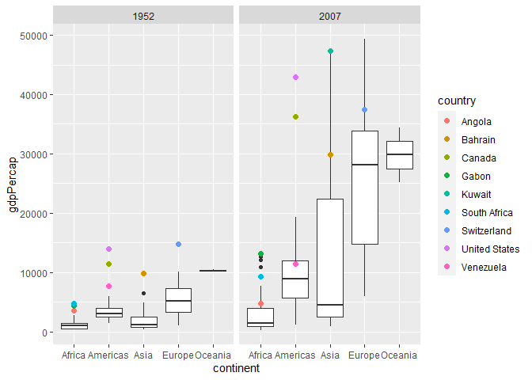
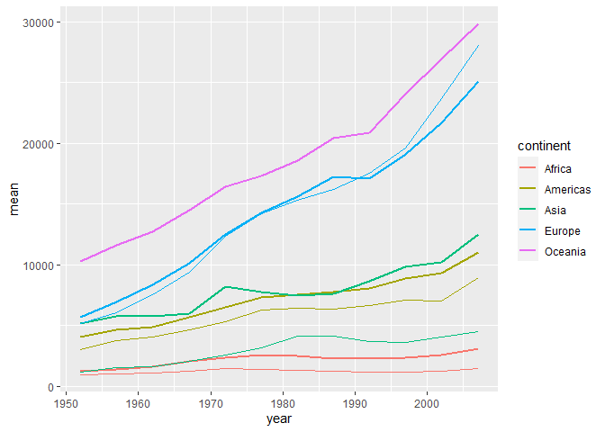
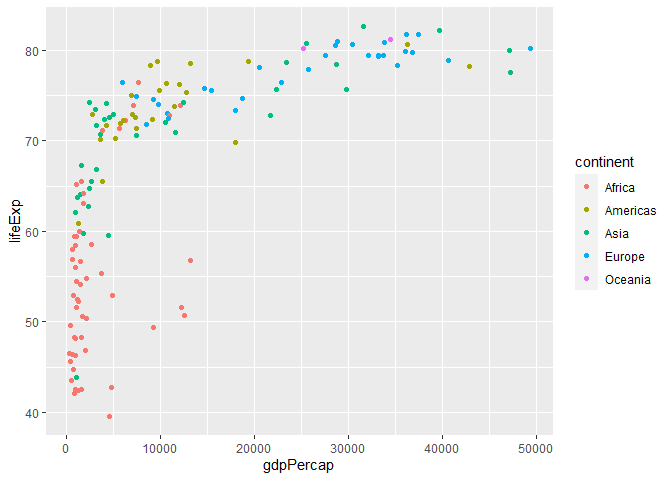
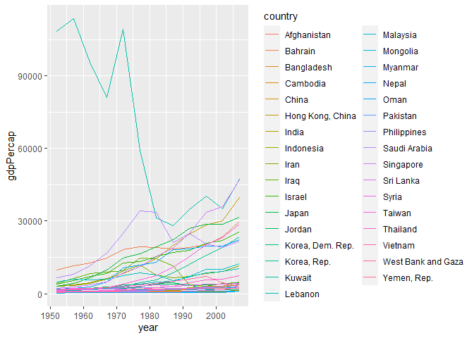

Gapminder
================
Meredith Alley
2023-2-23

- <a href="#grading-rubric" id="toc-grading-rubric">Grading Rubric</a>
  - <a href="#individual" id="toc-individual">Individual</a>
  - <a href="#due-date" id="toc-due-date">Due Date</a>
- <a href="#guided-eda" id="toc-guided-eda">Guided EDA</a>
  - <a
    href="#q0-perform-your-first-checks-on-the-dataset-what-variables-are-in-this"
    id="toc-q0-perform-your-first-checks-on-the-dataset-what-variables-are-in-this"><strong>q0</strong>
    Perform your “first checks” on the dataset. What variables are in
    this</a>
  - <a
    href="#q1-determine-the-most-and-least-recent-years-in-the-gapminder-dataset"
    id="toc-q1-determine-the-most-and-least-recent-years-in-the-gapminder-dataset"><strong>q1</strong>
    Determine the most and least recent years in the <code>gapminder</code>
    dataset.</a>
  - <a
    href="#q2-filter-on-years-matching-year_min-and-make-a-plot-of-the-gdp-per-capita-against-continent-choose-an-appropriate-geom_-to-visualize-the-data-what-observations-can-you-make"
    id="toc-q2-filter-on-years-matching-year_min-and-make-a-plot-of-the-gdp-per-capita-against-continent-choose-an-appropriate-geom_-to-visualize-the-data-what-observations-can-you-make"><strong>q2</strong>
    Filter on years matching <code>year_min</code>, and make a plot of the
    GDP per capita against continent. Choose an appropriate
    <code>geom_</code> to visualize the data. What observations can you
    make?</a>
  - <a
    href="#q3-you-should-have-found-at-least-three-outliers-in-q2-but-possibly-many-more-identify-those-outliers-figure-out-which-countries-they-are"
    id="toc-q3-you-should-have-found-at-least-three-outliers-in-q2-but-possibly-many-more-identify-those-outliers-figure-out-which-countries-they-are"><strong>q3</strong>
    You should have found <em>at least</em> three outliers in q2 (but
    possibly many more!). Identify those outliers (figure out which
    countries they are).</a>
  - <a
    href="#q4-create-a-plot-similar-to-yours-from-q2-studying-both-year_min-and-year_max-find-a-way-to-highlight-the-outliers-from-q3-on-your-plot-in-a-way-that-lets-you-identify-which-country-is-which-compare-the-patterns-between-year_min-and-year_max"
    id="toc-q4-create-a-plot-similar-to-yours-from-q2-studying-both-year_min-and-year_max-find-a-way-to-highlight-the-outliers-from-q3-on-your-plot-in-a-way-that-lets-you-identify-which-country-is-which-compare-the-patterns-between-year_min-and-year_max"><strong>q4</strong>
    Create a plot similar to yours from q2 studying both
    <code>year_min</code> and <code>year_max</code>. Find a way to highlight
    the outliers from q3 on your plot <em>in a way that lets you identify
    which country is which</em>. Compare the patterns between
    <code>year_min</code> and <code>year_max</code>.</a>
- <a href="#your-own-eda" id="toc-your-own-eda">Your Own EDA</a>
  - <a
    href="#q5-create-at-least-three-new-figures-below-with-each-figure-try-to-pose-new-questions-about-the-data"
    id="toc-q5-create-at-least-three-new-figures-below-with-each-figure-try-to-pose-new-questions-about-the-data"><strong>q5</strong>
    Create <em>at least</em> three new figures below. With each figure, try
    to pose new questions about the data.</a>

*Purpose*: Learning to do EDA well takes practice! In this challenge
you’ll further practice EDA by first completing a guided exploration,
then by conducting your own investigation. This challenge will also give
you a chance to use the wide variety of visual tools we’ve been
learning.

<!-- include-rubric -->

# Grading Rubric

<!-- -------------------------------------------------- -->

Unlike exercises, **challenges will be graded**. The following rubrics
define how you will be graded, both on an individual and team basis.

## Individual

<!-- ------------------------- -->

| Category    | Needs Improvement                                                                                                | Satisfactory                                                                                                               |
|-------------|------------------------------------------------------------------------------------------------------------------|----------------------------------------------------------------------------------------------------------------------------|
| Effort      | Some task **q**’s left unattempted                                                                               | All task **q**’s attempted                                                                                                 |
| Observed    | Did not document observations, or observations incorrect                                                         | Documented correct observations based on analysis                                                                          |
| Supported   | Some observations not clearly supported by analysis                                                              | All observations clearly supported by analysis (table, graph, etc.)                                                        |
| Assessed    | Observations include claims not supported by the data, or reflect a level of certainty not warranted by the data | Observations are appropriately qualified by the quality & relevance of the data and (in)conclusiveness of the support      |
| Specified   | Uses the phrase “more data are necessary” without clarification                                                  | Any statement that “more data are necessary” specifies which *specific* data are needed to answer what *specific* question |
| Code Styled | Violations of the [style guide](https://style.tidyverse.org/) hinder readability                                 | Code sufficiently close to the [style guide](https://style.tidyverse.org/)                                                 |

## Due Date

<!-- ------------------------- -->

All the deliverables stated in the rubrics above are due **at midnight**
before the day of the class discussion of the challenge. See the
[Syllabus](https://docs.google.com/document/d/1qeP6DUS8Djq_A0HMllMqsSqX3a9dbcx1/edit?usp=sharing&ouid=110386251748498665069&rtpof=true&sd=true)
for more information.

``` r
library(tidyverse)
```

    ## ── Attaching packages ─────────────────────────────────────── tidyverse 1.3.2 ──
    ## ✔ ggplot2 3.4.0      ✔ purrr   1.0.1 
    ## ✔ tibble  3.1.8      ✔ dplyr   1.0.10
    ## ✔ tidyr   1.2.1      ✔ stringr 1.5.0 
    ## ✔ readr   2.1.3      ✔ forcats 0.5.2 
    ## ── Conflicts ────────────────────────────────────────── tidyverse_conflicts() ──
    ## ✖ dplyr::filter() masks stats::filter()
    ## ✖ dplyr::lag()    masks stats::lag()

``` r
library(gapminder)
```

*Background*: [Gapminder](https://www.gapminder.org/about-gapminder/) is
an independent organization that seeks to educate people about the state
of the world. They seek to counteract the worldview constructed by a
hype-driven media cycle, and promote a “fact-based worldview” by
focusing on data. The dataset we’ll study in this challenge is from
Gapminder.

# Guided EDA

<!-- -------------------------------------------------- -->

First, we’ll go through a round of *guided EDA*. Try to pay attention to
the high-level process we’re going through—after this guided round
you’ll be responsible for doing another cycle of EDA on your own!

### **q0** Perform your “first checks” on the dataset. What variables are in this

dataset?

``` r
summary(gapminder)
```

    ##         country        continent        year         lifeExp     
    ##  Afghanistan:  12   Africa  :624   Min.   :1952   Min.   :23.60  
    ##  Albania    :  12   Americas:300   1st Qu.:1966   1st Qu.:48.20  
    ##  Algeria    :  12   Asia    :396   Median :1980   Median :60.71  
    ##  Angola     :  12   Europe  :360   Mean   :1980   Mean   :59.47  
    ##  Argentina  :  12   Oceania : 24   3rd Qu.:1993   3rd Qu.:70.85  
    ##  Australia  :  12                  Max.   :2007   Max.   :82.60  
    ##  (Other)    :1632                                                
    ##       pop              gdpPercap       
    ##  Min.   :6.001e+04   Min.   :   241.2  
    ##  1st Qu.:2.794e+06   1st Qu.:  1202.1  
    ##  Median :7.024e+06   Median :  3531.8  
    ##  Mean   :2.960e+07   Mean   :  7215.3  
    ##  3rd Qu.:1.959e+07   3rd Qu.:  9325.5  
    ##  Max.   :1.319e+09   Max.   :113523.1  
    ## 

``` r
glimpse(gapminder)
```

    ## Rows: 1,704
    ## Columns: 6
    ## $ country   <fct> "Afghanistan", "Afghanistan", "Afghanistan", "Afghanistan", …
    ## $ continent <fct> Asia, Asia, Asia, Asia, Asia, Asia, Asia, Asia, Asia, Asia, …
    ## $ year      <int> 1952, 1957, 1962, 1967, 1972, 1977, 1982, 1987, 1992, 1997, …
    ## $ lifeExp   <dbl> 28.801, 30.332, 31.997, 34.020, 36.088, 38.438, 39.854, 40.8…
    ## $ pop       <int> 8425333, 9240934, 10267083, 11537966, 13079460, 14880372, 12…
    ## $ gdpPercap <dbl> 779.4453, 820.8530, 853.1007, 836.1971, 739.9811, 786.1134, …

**Observations**:

- Variables: Country, Continent, Year, Life Expectancy, population, GDP
  per capita

### **q1** Determine the most and least recent years in the `gapminder` dataset.

*Hint*: Use the `pull()` function to get a vector out of a tibble.
(Rather than the `$` notation of base R.)

``` r
## TASK: Find the largest and smallest values of `year` in `gapminder`
year_max <- gapminder %>% 
  summarize(max = max(year)) %>% 
  pull(max)
year_min <- gapminder %>% 
  summarize(min = min(year)) %>% 
  pull(min)
```

Use the following test to check your work.

``` r
## NOTE: No need to change this
assertthat::assert_that(year_max %% 7 == 5)
```

    ## [1] TRUE

``` r
assertthat::assert_that(year_max %% 3 == 0)
```

    ## [1] TRUE

``` r
assertthat::assert_that(year_min %% 7 == 6)
```

    ## [1] TRUE

``` r
assertthat::assert_that(year_min %% 3 == 2)
```

    ## [1] TRUE

``` r
if (is_tibble(year_max)) {
  print("year_max is a tibble; try using `pull()` to get a vector")
  assertthat::assert_that(False)
}

print("Nice!")
```

    ## [1] "Nice!"

### **q2** Filter on years matching `year_min`, and make a plot of the GDP per capita against continent. Choose an appropriate `geom_` to visualize the data. What observations can you make?

You may encounter difficulties in visualizing these data; if so document
your challenges and attempt to produce the most informative visual you
can.

``` r
gapminder %>% 
  filter(year == year_min, gdpPercap < 30000) %>% 
  ggplot() + 
  geom_boxplot(aes(y = gdpPercap, x = continent))
```

<!-- -->

**Observations**:

- There’s a crazy outlier in Asia making it impossible to read any
  relevant information from the graph.
- After that outlier is removed, it’s clear that Oceania has both the
  most consistent and the highest GDP per capita
  - The consistency is likely due to the drastically fewer number of
    countries located in Oceania
- Africa and Asia have the lowest average GDP
- The Americas are also generally lower than Europe, but have a few high
  outliers that I bet I could guess

**Difficulties & Approaches**:

- The outlier in Asia was making it difficult to read the graph, so I
  filtered it out by reducing the cap for possible gdp to 30000.

### **q3** You should have found *at least* three outliers in q2 (but possibly many more!). Identify those outliers (figure out which countries they are).

``` r
gapminder %>% 
  filter(year == year_min) %>% 
  group_by(continent) %>% 
  mutate(iqr = IQR(gdpPercap), top = quantile(gdpPercap, prob = .75)) %>% 
  filter(gdpPercap > ((1.5*iqr) + top))
```

    ## # A tibble: 9 × 8
    ## # Groups:   continent [4]
    ##   country       continent  year lifeExp       pop gdpPercap   iqr   top
    ##   <fct>         <fct>     <int>   <dbl>     <int>     <dbl> <dbl> <dbl>
    ## 1 Angola        Africa     1952    30.0   4232095     3521.  920. 1455.
    ## 2 Bahrain       Asia       1952    50.9    120447     9867. 2286. 3035.
    ## 3 Canada        Americas   1952    68.8  14785584    11367. 1512. 3940.
    ## 4 Gabon         Africa     1952    37.0    420702     4293.  920. 1455.
    ## 5 Kuwait        Asia       1952    55.6    160000   108382. 2286. 3035.
    ## 6 South Africa  Africa     1952    45.0  14264935     4725.  920. 1455.
    ## 7 Switzerland   Europe     1952    69.6   4815000    14734. 3996. 7237.
    ## 8 United States Americas   1952    68.4 157553000    13990. 1512. 3940.
    ## 9 Venezuela     Americas   1952    55.1   5439568     7690. 1512. 3940.

**Observations**:

- Identify the outlier countries from q2
  - Africa
    - Angola

    - Gabon

    - South Africa
  - Asia
    - Bahrain

    - Kuwait (!!!!)

    - One of the ones displayed as an outlier above was not generated to
      be one here???
  - Americas
    - Canada

    - United States

    - Venezuela
  - Europe
    - Switzerland

*Hint*: For the next task, it’s helpful to know a ggplot trick we’ll
learn in an upcoming exercise: You can use the `data` argument inside
any `geom_*` to modify the data that will be plotted *by that geom
only*. For instance, you can use this trick to filter a set of points to
label:

``` r
## NOTE: No need to edit, use ideas from this in q4 below
gapminder %>%
  filter(year == max(year)) %>%

  ggplot(aes(continent, lifeExp)) +
  geom_boxplot() +
  geom_point(
    data = . %>% filter(country %in% c("United Kingdom", "Japan", "Zambia")),
    mapping = aes(color = country),
    size = 2
  )
```

<!-- -->

### **q4** Create a plot similar to yours from q2 studying both `year_min` and `year_max`. Find a way to highlight the outliers from q3 on your plot *in a way that lets you identify which country is which*. Compare the patterns between `year_min` and `year_max`.

*Hint*: We’ve learned a lot of different ways to show multiple
variables; think about using different aesthetics or facets.

``` r
gapminder %>% 
  filter(year %in% c(year_min, year_max), gdpPercap < 100000) %>% 
  ggplot(aes(y = gdpPercap, x = continent)) + 
  geom_boxplot() + 
  facet_grid(~ year) +
  geom_point(
    data = . %>% filter(country %in% c("Angola", "Gabon", "South Africa", "Bahrain", "Kuwait", "Canada", "United States", "Venezuela", "Switzerland")),
    mapping = aes(color = country),
    size = 2
  )
```

<!-- -->

**Observations**:

- No huge upsets, everyone that was an outlier is still above the median
  in their respective continent
- Kuwait’s GDP became much more reasonable in comparison to everyone
  else’s
- There was an increase proportional to inflation in most countries,
  first world countries being the most affected

# Your Own EDA

<!-- -------------------------------------------------- -->

Now it’s your turn! We just went through guided EDA considering the GDP
per capita at two time points. You can continue looking at outliers,
consider different years, repeat the exercise with `lifeExp`, consider
the relationship between variables, or something else entirely.

### **q5** Create *at least* three new figures below. With each figure, try to pose new questions about the data.

``` r
gapminder %>%
  group_by(continent, year) %>% 
  mutate(mean = mean(gdpPercap), med = median(gdpPercap)) %>% 
  ggplot() +
  geom_line(aes(x = year, y = mean, color = continent), size = 1) +
  geom_line(aes(x = year, y = med, color = continent), size = .5)
```

    ## Warning: Using `size` aesthetic for lines was deprecated in ggplot2 3.4.0.
    ## ℹ Please use `linewidth` instead.

<!-- -->

- I wanted to compare mean to median over time per continent, but didn’t
  know how to facet wrap it because it’s technically two graphs overlaid
- The result was basically what I expected
  - Asia (and to a lesser extent the Americas and Africa) has a mean far
    greater than its median, meaning it has distinct high outliers that
    are dragging the mean up

    - This pattern in Asia has been around since at least 1950, and is
      only getting more exacerbated as time goes on.

  - Oceania’s is directly overlaid, because there are only 2 countries

  - Europe’s mean is surprisingly lower than its median, indicating that
    more countries have a higher GDP, but there is at least one further
    away country in the lower direction, not necessarily an outlier in
    terms of IQR, but following a different pattern than in the Americas
    and Asia

``` r
gapminder %>% 
  filter(year == year_max) %>% 
  ggplot() + 
  geom_point(aes(x = gdpPercap, y = lifeExp, color = continent))
```

<!-- -->

- The trend here is pretty clear and also predictable - the countries
  with more money tend to have a higher life expectancy, particularly in
  the most recent year data was collected.
  - The trend isn’t as linear as I would expect, with a sharp dropoff as
    the gdp of the country approaches 0
- Additionally, when looking through the lens of sorting by continent,
  most countries with scarily low life expectancies are in Africa

``` r
gapminder %>% 
  filter(continent == "Asia") %>% 
  ggplot() + 
  geom_line(aes(x = year, y = gdpPercap, color = country))
```

<!-- -->

- You can see Kuwait’s general fall to be more in line with the world
  economy is very distinct in this graph
  - It happens between 1970 and 1980 pretty distinctly
- This graph is fairly hard to distinguish individual countries on,
  though
  - I had a similar problem with my actual intended graph, life
    expectancy in africa over the years but with individual lines for
    each country

    - The only way I could find to do that was to make country the
      color, and that created a legend so large the actual graph was
      illegible

    - How would I do that without differentiating the lines by
      individual country at all? Just with a general understanding that
      each line is a different country?

      - I know that that’s bad graph etiquette but I just want to see it
        in order to formulate follow up questions haha
