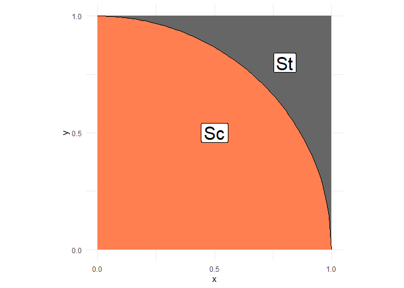

Estimating Pi With a Shotgun
================
Meredith Alley
2023-3-26

- <a href="#grading-rubric" id="toc-grading-rubric">Grading Rubric</a>
  - <a href="#individual" id="toc-individual">Individual</a>
  - <a href="#due-date" id="toc-due-date">Due Date</a>
- <a href="#monte-carlo" id="toc-monte-carlo">Monte Carlo</a>
  - <a href="#theory" id="toc-theory">Theory</a>
  - <a href="#implementation" id="toc-implementation">Implementation</a>
    - <a
      href="#q1-pick-a-sample-size-n-and-generate-n-points-uniform-randomly-in-the-square-x-in-0-1-and-y-in-0-1-create-a-column-stat-whose-mean-will-converge-to-pi"
      id="toc-q1-pick-a-sample-size-n-and-generate-n-points-uniform-randomly-in-the-square-x-in-0-1-and-y-in-0-1-create-a-column-stat-whose-mean-will-converge-to-pi"><strong>q1</strong>
      Pick a sample size <span class="math inline"><em>n</em></span> and
      generate <span class="math inline"><em>n</em></span> points <em>uniform
      randomly</em> in the square <span
      class="math inline"><em>x</em> ∈ [0,1]</span> and <span
      class="math inline"><em>y</em> ∈ [0,1]</span>. Create a column
      <code>stat</code> whose mean will converge to <span
      class="math inline"><em>π</em></span>.</a>
    - <a href="#q2-using-your-data-in-df_q1-estimate-pi"
      id="toc-q2-using-your-data-in-df_q1-estimate-pi"><strong>q2</strong>
      Using your data in <code>df_q1</code>, estimate <span
      class="math inline"><em>π</em></span>.</a>
- <a href="#quantifying-uncertainty"
  id="toc-quantifying-uncertainty">Quantifying Uncertainty</a>
  - <a
    href="#q3-using-a-clt-approximation-produce-a-confidence-interval-for-your-estimate-of-pi-make-sure-you-specify-your-confidence-level-does-your-interval-include-the-true-value-of-pi-was-your-chosen-sample-size-sufficiently-large-so-as-to-produce-a-trustworthy-answer"
    id="toc-q3-using-a-clt-approximation-produce-a-confidence-interval-for-your-estimate-of-pi-make-sure-you-specify-your-confidence-level-does-your-interval-include-the-true-value-of-pi-was-your-chosen-sample-size-sufficiently-large-so-as-to-produce-a-trustworthy-answer"><strong>q3</strong>
    Using a CLT approximation, produce a confidence interval for your
    estimate of <span class="math inline"><em>π</em></span>. Make sure you
    specify your confidence level. Does your interval include the true value
    of <span class="math inline"><em>π</em></span>? Was your chosen sample
    size sufficiently large so as to produce a trustworthy answer?</a>
- <a href="#references" id="toc-references">References</a>

*Purpose*: Random sampling is extremely powerful. To build more
intuition for how we can use random sampling to solve problems, we’ll
tackle what—at first blush—doesn’t seem appropriate for a random
approach: estimating fundamental deterministic constants. In this
challenge you’ll work through an example of turning a deterministic
problem into a random sampling problem, and practice quantifying
uncertainty in your estimate.

<!-- include-rubric -->

# Grading Rubric

<!-- -------------------------------------------------- -->

Unlike exercises, **challenges will be graded**. The following rubrics
define how you will be graded, both on an individual and team basis.

## Individual

<!-- ------------------------- -->

| Category    | Needs Improvement                                                                                                | Satisfactory                                                                                                               |
|-------------|------------------------------------------------------------------------------------------------------------------|----------------------------------------------------------------------------------------------------------------------------|
| Effort      | Some task **q**’s left unattempted                                                                               | All task **q**’s attempted                                                                                                 |
| Observed    | Did not document observations, or observations incorrect                                                         | Documented correct observations based on analysis                                                                          |
| Supported   | Some observations not clearly supported by analysis                                                              | All observations clearly supported by analysis (table, graph, etc.)                                                        |
| Assessed    | Observations include claims not supported by the data, or reflect a level of certainty not warranted by the data | Observations are appropriately qualified by the quality & relevance of the data and (in)conclusiveness of the support      |
| Specified   | Uses the phrase “more data are necessary” without clarification                                                  | Any statement that “more data are necessary” specifies which *specific* data are needed to answer what *specific* question |
| Code Styled | Violations of the [style guide](https://style.tidyverse.org/) hinder readability                                 | Code sufficiently close to the [style guide](https://style.tidyverse.org/)                                                 |

## Due Date

<!-- ------------------------- -->

All the deliverables stated in the rubrics above are due **at midnight**
before the day of the class discussion of the challenge. See the
[Syllabus](https://docs.google.com/document/d/1qeP6DUS8Djq_A0HMllMqsSqX3a9dbcx1/edit?usp=sharing&ouid=110386251748498665069&rtpof=true&sd=true)
for more information.

``` r
library(tidyverse)
```

    ## ── Attaching packages ─────────────────────────────────────── tidyverse 1.3.2 ──
    ## ✔ ggplot2 3.4.0      ✔ purrr   1.0.1 
    ## ✔ tibble  3.1.8      ✔ dplyr   1.0.10
    ## ✔ tidyr   1.2.1      ✔ stringr 1.5.0 
    ## ✔ readr   2.1.3      ✔ forcats 0.5.2 
    ## ── Conflicts ────────────────────────────────────────── tidyverse_conflicts() ──
    ## ✖ dplyr::filter() masks stats::filter()
    ## ✖ dplyr::lag()    masks stats::lag()

*Background*: In 2014, some crazy Quebecois physicists estimated $\pi$
with a pump-action shotgun\[1,2\]. Their technique was based on the
*Monte Carlo method*, a general strategy for turning deterministic
problems into random sampling.

# Monte Carlo

<!-- -------------------------------------------------- -->

The [Monte Carlo
method](https://en.wikipedia.org/wiki/Monte_Carlo_method) is the use of
randomness to produce approximate answers to deterministic problems. Its
power lies in its simplicity: So long as we can take our deterministic
problem and express it in terms of random variables, we can use simple
random sampling to produce an approximate answer. Monte Carlo has an
[incredible
number](https://en.wikipedia.org/wiki/Monte_Carlo_method#Applications)
of applications; for instance Ken Perlin won an [Academy
Award](https://en.wikipedia.org/wiki/Perlin_noise) for developing a
particular flavor of Monte Carlo for generating artificial textures.

I remember when I first learned about Monte Carlo, I thought the whole
idea was pretty strange: If I have a deterministic problem, why wouldn’t
I just “do the math” and get the right answer? It turns out “doing the
math” is often hard—and in some cases an analytic solution is simply not
possible. Problems that are easy to do by hand can quickly become
intractable if you make a slight change to the problem formulation.
Monte Carlo is a *general* approach; so long as you can model your
problem in terms of random variables, you can apply the Monte Carlo
method. See Ref. \[3\] for many more details on using Monte Carlo.

In this challenge, we’ll tackle a deterministic problem (computing
$\pi$) with the Monte Carlo method.

## Theory

<!-- ------------------------- -->

The idea behind estimating $\pi$ via Monte Carlo is to set up a
probability estimation problem whose solution is related to $\pi$.
Consider the following sets: a square with side length one $St$, and a
quarter-circle $Sc$.

``` r
## NOTE: No need to edit; this visual helps explain the pi estimation scheme
tibble(x = seq(0, 1, length.out = 100)) %>%
  mutate(y = sqrt(1 - x^2)) %>%

  ggplot(aes(x, y)) +
  annotate(
    "rect",
    xmin = 0, ymin = 0, xmax = 1, ymax = 1,
    fill = "grey40",
    size = 1
  ) +
  geom_ribbon(aes(ymin = 0, ymax = y), fill = "coral") +
  geom_line() +
  annotate(
    "label",
    x = 0.5, y = 0.5, label = "Sc",
    size = 8
  ) +
  annotate(
    "label",
    x = 0.8, y = 0.8, label = "St",
    size = 8
  ) +
  scale_x_continuous(breaks = c(0, 1/2, 1)) +
  scale_y_continuous(breaks = c(0, 1/2, 1)) +
  theme_minimal() +
  coord_fixed()
```

    ## Warning: Using `size` aesthetic for lines was deprecated in ggplot2 3.4.0.
    ## ℹ Please use `linewidth` instead.

<!-- -->

The area of the set $Sc$ is $\pi/4$, while the area of $St$ is $1$. Thus
the probability that a *uniform* random variable over the square lands
inside $Sc$ is the ratio of the areas, that is

$$\mathbb{P}_{X}[X \in Sc] = (\pi / 4) / 1 = \frac{\pi}{4}.$$

This expression is our ticket to estimating $\pi$ with a source of
randomness: If we estimate the probability above and multiply by $4$,
we’ll be estimating $\pi$.

## Implementation

<!-- ------------------------- -->

Remember in `e-stat02-probability` we learned how to estimate
probabilities as the limit of frequencies. Use your knowledge from that
exercise to generate Monte Carlo data.

### **q1** Pick a sample size $n$ and generate $n$ points *uniform randomly* in the square $x \in [0, 1]$ and $y \in [0, 1]$. Create a column `stat` whose mean will converge to $\pi$.

*Hint*: Remember that the mean of an *indicator function* on your target
set will estimate the probability of points landing in that area (see
`e-stat02-probability`). Based on the expression above, you’ll need to
*modify* that indicator to produce an estimate of $\pi$.

``` r
## TASK: Choose a sample size and generate samples
n <- 1000 # Choose a sample size
df_q1 <- 
  tibble(
    x = runif(n = n),
    y = runif(n = n)
  ) %>%
    mutate(stat = 4*(sqrt(x^2 + y^2) <= 1)) # Distance from origin is <= 1

df_q1
```

    ## # A tibble: 1,000 × 3
    ##        x     y  stat
    ##    <dbl> <dbl> <dbl>
    ##  1 0.956 0.164     4
    ##  2 0.838 0.582     0
    ##  3 0.988 0.242     0
    ##  4 0.125 0.775     4
    ##  5 0.437 0.509     4
    ##  6 0.788 0.832     0
    ##  7 0.264 0.254     4
    ##  8 0.441 0.197     4
    ##  9 0.603 0.102     4
    ## 10 0.176 0.304     4
    ## # … with 990 more rows

### **q2** Using your data in `df_q1`, estimate $\pi$.

``` r
## TASK: Estimate pi using your data from q1
pi_est <- df_q1 %>% 
  summarise(mean(stat))
pi_est
```

    ## # A tibble: 1 × 1
    ##   `mean(stat)`
    ##          <dbl>
    ## 1         3.04

# Quantifying Uncertainty

<!-- -------------------------------------------------- -->

You now have an estimate of $\pi$, but how trustworthy is that estimate?
In `e-stat06-clt` we discussed *confidence intervals* as a means to
quantify the uncertainty in an estimate. Now you’ll apply that knowledge
to assess your $\pi$ estimate.

### **q3** Using a CLT approximation, produce a confidence interval for your estimate of $\pi$. Make sure you specify your confidence level. Does your interval include the true value of $\pi$? Was your chosen sample size sufficiently large so as to produce a trustworthy answer?

``` r
q99 <- qnorm( 1 - (1 - 0.99) / 2 )
df_q1 %>%
  summarize(across(
    stat,
    c(
      "mean" = ~mean(., na.rm = TRUE),
      "se" = ~sd(., na.rm = TRUE) / length(.)
    )
  )) %>%
  mutate(
    pi_lo = stat_mean - q99 * stat_se,
    pi_hi = stat_mean + q99 * stat_se,
    n = n
  )
```

    ## # A tibble: 1 × 5
    ##   stat_mean stat_se pi_lo pi_hi     n
    ##       <dbl>   <dbl> <dbl> <dbl> <dbl>
    ## 1      3.04 0.00171  3.04  3.05  1000

**Observations**:

- Does your interval include the true value of $\pi$?
  - Nope, off in the hundredths place!
- What confidence level did you choose?
  - 99%
- Was your sample size $n$ large enough? Why do you say that?
  - No, my sample size of 1000 was not large enough, because the
    reliability of this representation is limited - it rarely includes
    the actual value for pi.

# References

<!-- -------------------------------------------------- -->

\[1\] Dumoulin and Thouin, “A Ballistic Monte Carlo Approximation of Pi”
(2014) ArXiv, [link](https://arxiv.org/abs/1404.1499)

\[2\] “How Mathematicians Used A Pump-Action Shotgun to Estimate Pi”,
[link](https://medium.com/the-physics-arxiv-blog/how-mathematicians-used-a-pump-action-shotgun-to-estimate-pi-c1eb776193ef)

\[3\] Art Owen “Monte Carlo”,
[link](https://statweb.stanford.edu/~owen/mc/)
